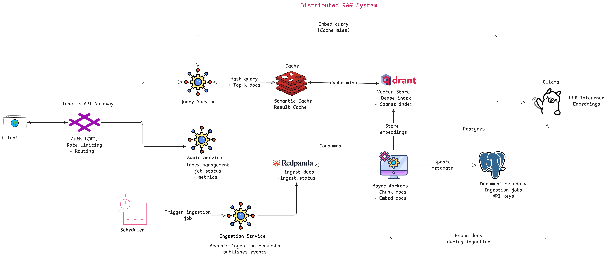
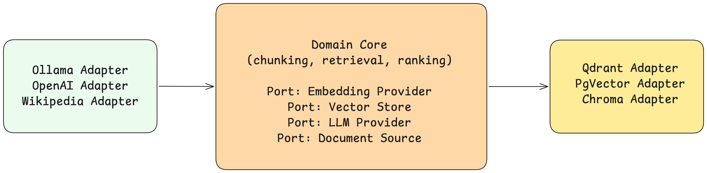
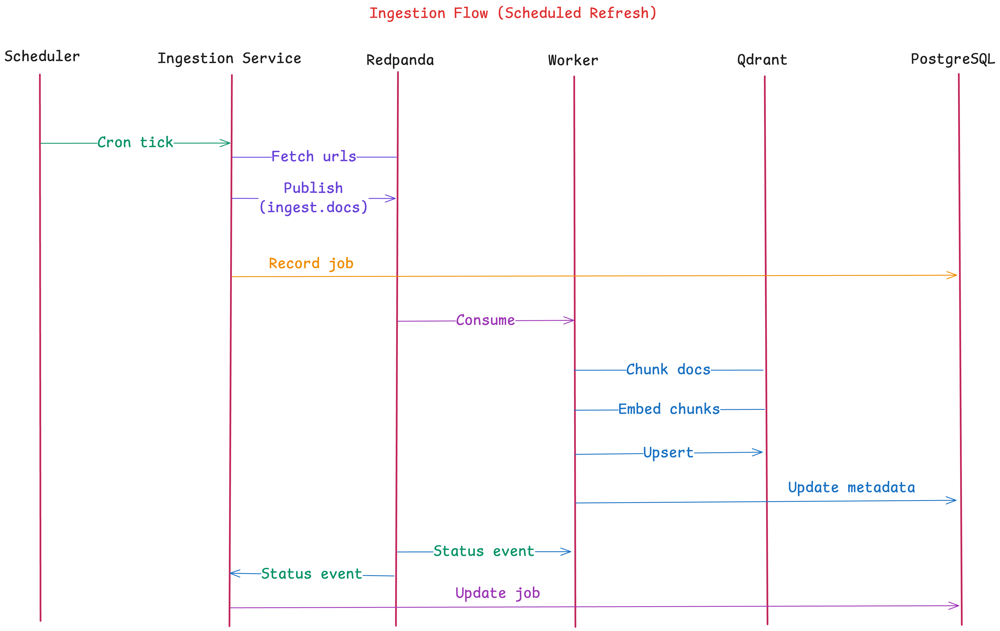
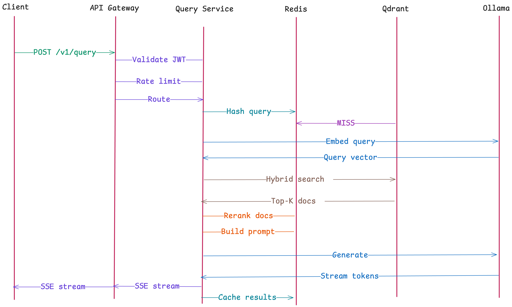
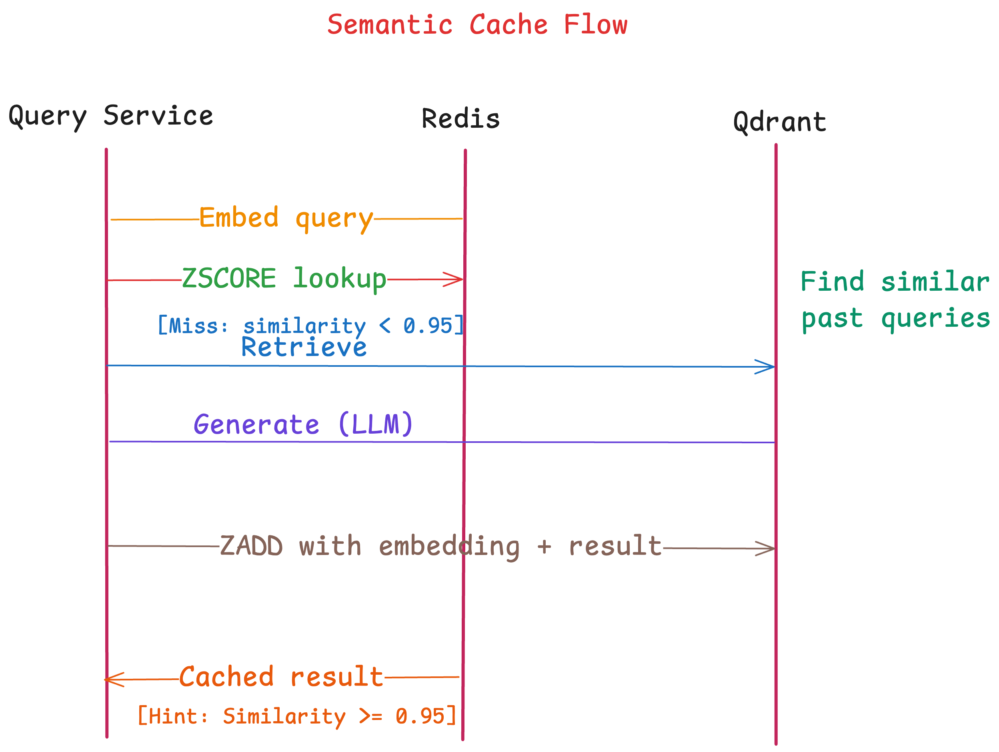

# Distributed RAG System

> A production-grade Retrieval Augmented Generation (RAG) platform built on distributed systems principles.
> Designed as a reference implementation for engineering teams who want to run RAG in production.

---

## What This Is

This system ingests documents from Wikipedia (pluggable, i.e., you can replace it with any other data source), chunks and embeds them into a vector database, and answers natural language queries by retrieving relevant context and generating grounded responses via a local LLM.

### What makes it "production-grade"

- **Not a notebook project** — every component is a deployable service
- **No framework lock-in** — core logic sits behind interfaces; swapping Qdrant for pgvector or Ollama for OpenAI requires changing one adapter class
- **Operationally complete** — ingestion pipeline, two-layer semantic cache, JWT auth, observability, and RAGAS evaluation are all included
- **Horizontally scalable** — every service is stateless and scales independently
- **Event-driven ingestion** — documents flow through Redpanda asynchronously; ingestion never blocks query serving

### What it is NOT

- Not a chatbot with memory (no session state)
- Not an ML training platform
- Not a multi-agent framework

---

## Architecture



| Service               | Responsibility                        | Port |
| --------------------- | ------------------------------------- | ---- |
| API Gateway (Traefik) | Auth, routing, rate limiting          | 80   |
| Query Service         | Hybrid retrieval + LLM generation     | 8001 |
| Ingestion Service     | Accept requests, publish to Redpanda  | 8002 |
| Worker Service        | Consume events, chunk + embed + store | —    |

### Design Philosophy

**Hexagonal Architecture (Ports & Adapters)** — core business logic (chunking, retrieval, ranking) has zero infrastructure dependencies. Databases and LLM providers plug in as adapters.



**Event-driven ingestion** — ingestion is never synchronous with query serving. Documents flow through a pipeline triggered by events, not chained API calls.



**Two-layer semantic cache** — exact cache (Redis SHA-256) for identical queries, semantic cache (Qdrant cosine similarity) for near-duplicate queries. Cache hits are ~200x faster than a full RAG pipeline.





---

## Tech Stack

| Concern           | Technology                                      |
| ----------------- | ----------------------------------------------- |
| LLM               | `qwen2.5:14b` via Ollama (pluggable)            |
| Embeddings        | `nomic-embed-text` 768d via Ollama (pluggable)  |
| Sparse Embeddings | BM25 via fastembed                              |
| Vector Store      | Qdrant (named vectors: dense + sparse)          |
| Hybrid Search     | Reciprocal Rank Fusion (RRF)                    |
| Re-ranking        | FlashRank (local cross-encoder)                 |
| Cache             | Redis (exact) + Qdrant (semantic)               |
| Message Broker    | Redpanda (Kafka-compatible, no ZooKeeper)       |
| Metadata DB       | PostgreSQL                                      |
| API Gateway       | Traefik                                         |
| Auth              | JWT (python-jose)                               |
| Evaluation        | RAGAS                                           |
| Observability     | structlog + Prometheus + OpenTelemetry + Jaeger |
| Package Manager   | uv                                              |

---

## Prerequisites

- **Docker Desktop** running
- **Ollama** installed — pull the required models:
  ```bash
  ollama pull nomic-embed-text
  ollama pull qwen2.5:14b
  ```
- **uv** installed — `curl -LsSf https://astral.sh/uv/install.sh | sh`

---

## Quick Start

### 1. Start infrastructure

```bash
cd infrastructure/docker
docker compose -f docker-compose.infra.yml up -d
```

This starts: Qdrant, Redis, PostgreSQL, Redpanda, Ollama, Prometheus, Jaeger, Traefik.

### 2. Create Redpanda topics and Qdrant collections

```bash
bash infrastructure/scripts/init_topics.sh
bash infrastructure/scripts/init_qdrant.sh
```

### 3. Start the services (each in a separate terminal)

```bash
# Ingestion service
cd services/ingestion
uv run uvicorn src.main:app --port 8002 --reload

# Worker service
cd services/worker
uv run python -m src.main

# Query service
cd services/query
uv run uvicorn src.main:app --port 8001 --reload
```

### 4. Ingest documents

```bash
curl -X POST http://localhost/v1/ingest/category \
  -H "Content-Type: application/json" \
  -d '{"category": "Distributed computing", "limit": 20}'

curl -X POST http://localhost/v1/ingest/category \
  -H "Content-Type: application/json" \
  -d '{"category": "Consensus algorithms", "limit": 10}'
```

Watch the worker logs — documents are chunked, embedded, and stored in Qdrant.

### 5. Query

```bash
# Get a token
TOKEN=$(curl -s -X POST http://localhost/v1/auth/token \
  -H "Content-Type: application/json" \
  -d '{"api_key": "dev-key-1"}' | python3 -c \
  "import sys,json; print(json.load(sys.stdin)['access_token'])")

# Ask a question
curl -X POST http://localhost/v1/query \
  -H "Authorization: Bearer $TOKEN" \
  -H "Content-Type: application/json" \
  -d '{"text": "What is the CAP theorem?", "stream": false}'
```

---

## Observability

| Dashboard        | URL                             |
| ---------------- | ------------------------------- |
| Traefik          | http://localhost:8088           |
| Prometheus       | http://localhost:9090           |
| Jaeger           | http://localhost:16686          |
| Redpanda Console | http://localhost:8080           |
| Qdrant UI        | http://localhost:6333/dashboard |

---

## Evaluation

```bash
# Generate golden Q&A dataset
cd evals
TOKEN=<your_token>
uv run python datasets/generate_golden_set.py --token "$TOKEN"

# Review candidates.json — set review_status: "approved" for good answers

# Run RAGAS evaluation
uv run python runners/ragas_eval.py --token "$TOKEN" --output results/ragas_v1.csv

# Run latency benchmark
uv run python runners/latency_bench.py --token "$TOKEN" --rounds 3

# Compare multiple runs
uv run python runners/compare_reports.py results/ragas_*.csv
```

---

## Project Structure

```
.
├── services/
│   ├── query/          # Retrieval + generation service (port 8001)
│   ├── ingestion/      # Document ingestion API (port 8002)
│   └── worker/         # Async chunk/embed/index worker
├── shared/             # Shared Pydantic models and events (rag-shared package)
├── infrastructure/
│   ├── docker/         # docker-compose + Traefik + Prometheus config
│   └── scripts/        # init_topics.sh, init_qdrant.sh
├── evals/              # RAGAS evaluation framework + latency benchmarks
└── docs/
    └── high_level_design/  # Architecture diagrams + full design document
```

---

## Full Design Document

See [`docs/high_level_design/high_leve_design_doc.md`](docs/high_level_design/high_leve_design_doc.md) for the complete system design including:

- All technology decisions with rationale
- Data flow sequence diagrams
- Caching strategy deep-dive
- Authentication design
- Evaluation framework design
- Architecture Decision Records
